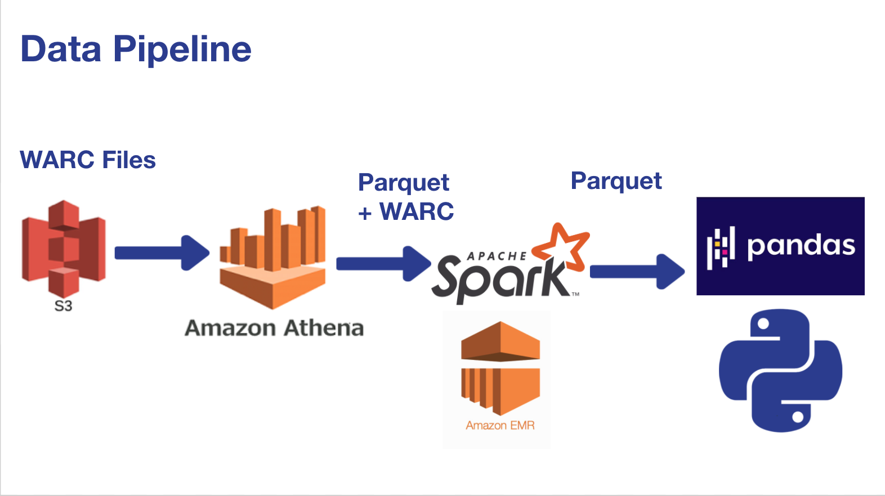

# Table of Contents

1. [Introduction](README.md#introduction)
2. [Pipeline](README.md#pipeline)
3. [Requirements](README.md#requirements)
4. [Environment Set Up](README.md#Environment%20Setup)
5. [Repository Structure and Run Instructions](README.md#Repository%20Structure%20and%20Run%20Instructions)

# Introduction

**Price Crawler: Tracking Price Inflation**

The goal of this project is to calculate inflation rates from first principles.
That means calculating inflation rate using prices of goods and services sold online.

In this project, I built a pipleine to use petabytes of web page data contained in the [Common Crawl](https://commoncrawl.org/), an archive of web page content
to calculate inflation rates. The results can be used to enhance investment strategies or by businesses in deciding the cost of products. A sample batch job has
been executed using online laptop prices ($500-$800) and the inflation rate in 2019 is measured to be 4.8% which is more than double the annual inflation rate of
2.3% reported by Bureau of labor statistics for 2019. A recording of the WebUI is also available [here](https://www.youtube.com/watch?v=mNcodsH5254&feature=youtu.be).

# Pipeline

I built a data pipeline that utilizes petabytes of publicly available web page data to **Calculate Inflation rates from first principles (Prices of Products)**

1. AWS Athena to query indexed WARC Files using HTTP header information in WARC Files
   - Scan 0(100 GB) data instead of PB
2. **Keys** to webpages of interest saved in parquet files on S3
3. Parquet + WARC input to Spark with distributed processing over O(10 GB) data per job
4. Cleaning, filtering and aggregating Product and Price tables with Pandas in Python
5. Plotting and tracking price trends with Dash

# Development work

I built a rapid prototype of the pipeline during the first week to understand the scope of the problem and learn textual and HTML content analysis.
Ingested data from AWS S3, cleaned and filtered with single-threaded python script and aggregated product information in a local Amazon DyanmoDB database

`./prototype/` contains all python configuration files and scripts for running the project locally and output product info to a local amazon dynamoDB table

Languages

- Bash
- Python 3.7

Technologies

- Amazon DynamoDB
